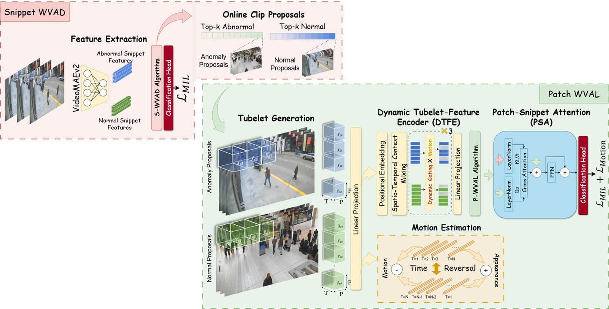
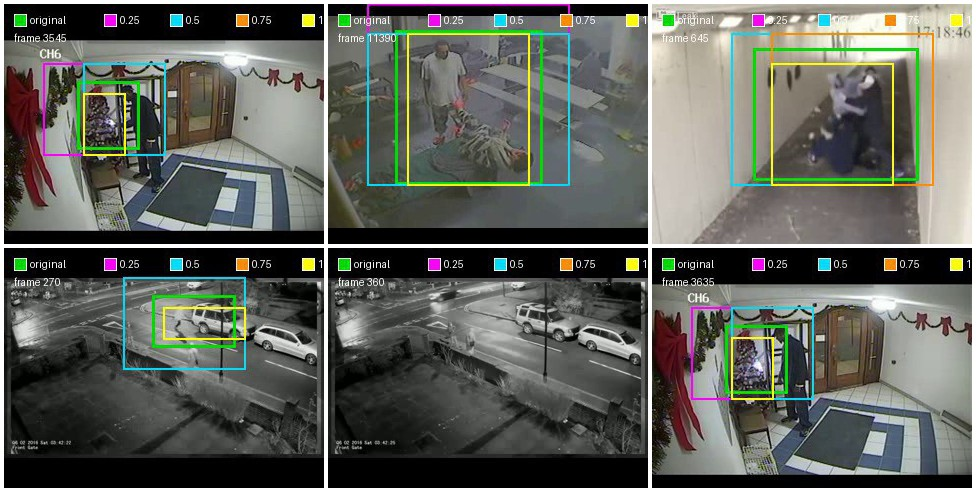

# Localizing to Debias: A Patch-Level Benchmark and Baseline for Weakly Supervised Spatial Anomaly Detection


## Overview

This repository provides the official implementation for the Sparse Spatio-temporal Weakly Supervised Video Anomaly Detection and Localization framework(SST-WSVADL)


## Installation

### Requirements

- Python 3.8+
- PyTorch 1.8+
- CUDA-capable GPU

### Setup

1. Clone or copy this repository:
```bash
cd SST-WSVADL
```

2. Install dependencies:
```bash
pip install -r requirements.txt
```

## Dataset Preparation
__Option A:__  
Download the dataset ([UCF-Crime](), [MSAD](), [XD-Violence]()), and extract video features using I3D or VideoMAEv2 public repositories. Then, prepare the dataset list files in the `list/` directory and paths in the configuration.

__Option B:__  
Download our extracted VideoMAEv2 features, provided here [UCF-Crime](https://drive.google.com/file/d/1yzAbi5Gn64TcnGeCrRBC8L1T_E8Bmeas/view?usp=sharing), [MSAD](), [XD-Violence]().


## Usage

### Training Structure

The training script structure demonstrates the two-stage training approach:
```bash
# Basic command structure (update paths and ensure dependencies)
python train.py \
    --dataset ucf \
    --batch_size 16 \
    --segment_length 16 \
    --num_tubelet 8 \
    --patch_size 16 \
    --resize 128 128 \
    --output_path ./outputs \
    --model_path ./models/exp_x \
    --video_root /path/to/videos \
    --test_file /path/to/ground_truth.npy
```

### Key Parameters

- `--dataset`: Dataset name (default: ucf)
- `--batch_size`: Batch size for training (default: 16)
- `--segment_length`: Number of frames per segment (default: 16)
- `--num_tubelet`: Number of temporal tubelets (default: 8)
- `--patch_size`: Patch size for spatial division (default: 16)
- `--resize`: Resize dimensions for frames (default: 128 128)
- `--lr`: Learning rate (default: 0.0001)
- `--num_epochs`: Number of training epochs (default: 4000)
- `--cross_attention`: Enable patch-to-snippet attention


### Patch-level evaluation protocol

#### Patch vs. BBox ground truth

Released spatial annotations are in bounding box format, placed under `annotations/merged_*.json`. These include the annotations made by the annotation tool [](). 

In order to derive the patch-level ground truths for the 8x8 patch scheme on 128x128 frame resolution, we measure thee patch to gt-bbox IoU overlap and assign a patch label `1` if it overlaps at least n% with the bounding box. We test n at [25,50,75,100]. The main paper reports metrics at 25% overlap (Table-5), whereas evaluations at other overlap thresholds are reported in supplementary (Table S10). The difference between boxes at the three thresholds is highlighted below. 

Colors: green = original · magenta = 0.25 · cyan = 0.50 · orange = 0.75 · yellow = 1.0




Note that for **UCF-Crime**, we further report _TIoU_sub_ which is computed based on [previous bbox annotations](https://github.com/xuzero/UCFCrime_BoundingBox_Annotation), applying the same patch-to-bbox quantization protocol above to obtain *bbox predictions* from patches.

<code style="color : red">**IMPORTANT NOTE:**</code>   
How to use the annotations to reproduce our results or compare with SST-WSVADL performance:

1. If anomaly predictions are in form of bounding boxes: 
    + compare with our main-paper results by using the 0.25-quantized bounding-box annotations `annotations/*_0.25_quantized.json`
    + compare with our supplementary results at other overlap thresholds by using the `annotations/*_n_quantized.json`
    + compare with our results using the original bbox annotations (see table below).

2. If anomaly predictions are in different format, such as heatmaps produced from attention maps, check our patch to heatmap conversion scheme in << add the file that performs the visualization.>> 


SST-WSVADL **bbox TIoU (%)** produced by the released checkpoints when scored
against each GT annotation file (original boxes vs overlap-quantized boxes).
Eval protocol matches the paper (bbox IoU + temporal gate). The **0.25** column
is the paper GT construction; `annotations/*_0.25_quantized.json` reproduces the same numbers as reconstructing GT boxes from the 0.25 patch maps.

### Running evaluation

1. <code style="color : salmon">Temporal Detection:</code>Export temporal frame-level scores once (JSON) before running the patch-level evaluation in the next step:
```bash
python eval/export_frame_scores.py \
    --model_dir models \
    --dataset ucf \
    --output predictions/frame_scores.json \
    --save_snippet_features
```

2. <code style="color : yellowgreen">Spatial Localization:</code> SST 8x8 evaluation (DTFE + spatial head):
```bash
python eval/patch_evaluation_sst.py \
    --model_dir models \
    --frame_scores predictions/frame_scores.json \
    --snippet_features predictions/frame_scores_snippet_features.npz \
    --video_root /path/to/ucf/videos \
    --output_dir outputs/patch_eval
```

BBox TIoU uses `annotations/*_0.25_quantized.json` by default. Pass
`--bbox_annotations ''` to fall back to reconstructing GT boxes from patch maps,
or point `--bbox_annotations` at another `*_n_quantized.json` / `*_original.json`.

3. Generic grid spatial evaluation (any HxW, from cached patch scores):
```bash
python eval/patch_evaluation_generic.py \
    --patch_preds outputs/patch_eval/patch_preds.npy \
    --frame_scores predictions/frame_scores.json \
    --grid_h 8 --grid_w 8
```

TIoU defaults to the paper protocol (legacy): frames without a GT box can still
contribute 0 when the temporal score is below threshold. Use
`--anomaly_frames_only` to average only over frames that have a GT box.
Use `--iou_mode patch` for binary patch-set IoU instead of the paper bbox protocol.

### Compare original vs quantized boxes

```bash
# Original vs released (0.25) JSON
python eval/overlay_bbox_comparison.py --dataset ucf --num_videos 5

# Original + overlap thresholds 0.25 / 0.50 / 0.75 / 1.0 (different colors)
python eval/overlay_bbox_comparison.py --dataset ucf \
    --thresholds 0.25 0.50 0.75 1.0 \
    --video_names Vandalism007_x264.mp4 Assault010_x264.mp4 Arson022_x264.mp4
```

Outputs: `vis/bbox_compare/{dataset}/` (pairwise) or `.../thresholds/` (multi).
Colors: green=original, magenta=0.25, cyan=0.50, orange=0.75, yellow=1.0.

## Future Work / Todo

[ ] Add soft-pruning feature  
[ ] Performance optimization  
[ ] RGB-thermal fusion support

## Acknowledgments

This implementation is based on:
- [UR-DMU](https://github.com/henrryzh1/UR-DMU.git)
- [STPrivacy](https://github.com/ming1993li/stprivacy.git)
- [DynamicViT](https://github.com/raoyongming/DynamicViT.git)

